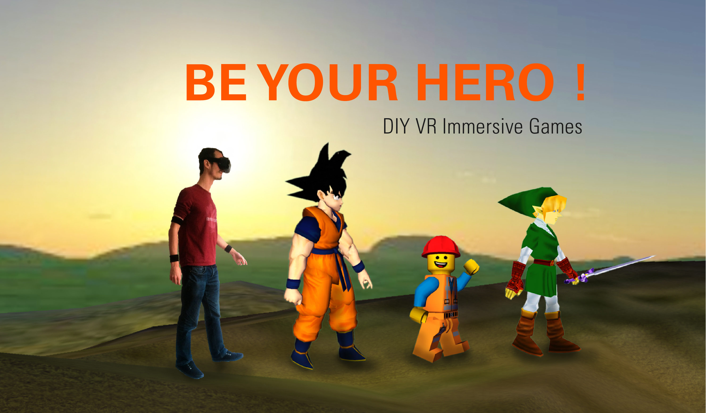

# Be Your Hero!

---

Welcome to Be Your Hero ! project
This project will give you a full gesture control of any virtual hero you like with a simple set of inexpensive devices using sensors. 
The code is still in development, many improvement should be ready on the next few weeks. 

Created by [Jean Perardel](http://www.instructables.com/member/jeanotP1314/) from [Lab_1314](https://www.youtube.com/watch?v=qNliaFjvuI0&t=1s).

Status: *** In development ***

---

## Installation

These instructions are for Debian/Ubuntu based distributions. Please
adapt the packages to your distribution

First, install the required packages:

    sudo apt-get update -y
    sudo apt-get install -y python3-dev python3-setuptools libjpeg-dev zlib1g-dev libpng12-dev libfreetype6-dev python3-pip libhidapi-libusb0 xboxdrv libopenhmd-dev

Then clone the project and install the dependencies:

    git clone https://github.com/jeanot1314/BeYourHero.git
    cd BeYourHero
    sudo pip3 install -r requirements.txt

## Run

Execute the script `src/RUN.py`:

    sudo python3 src/RUN.py

## update

